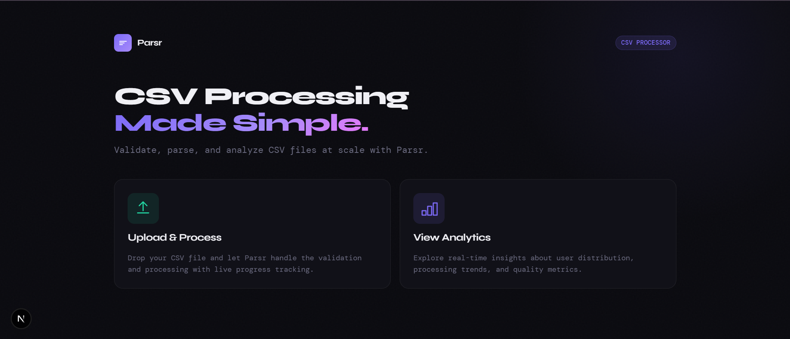
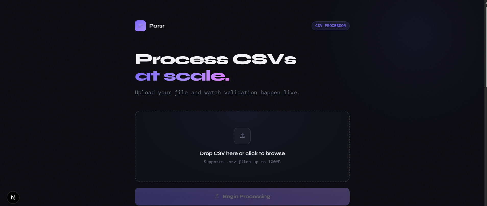
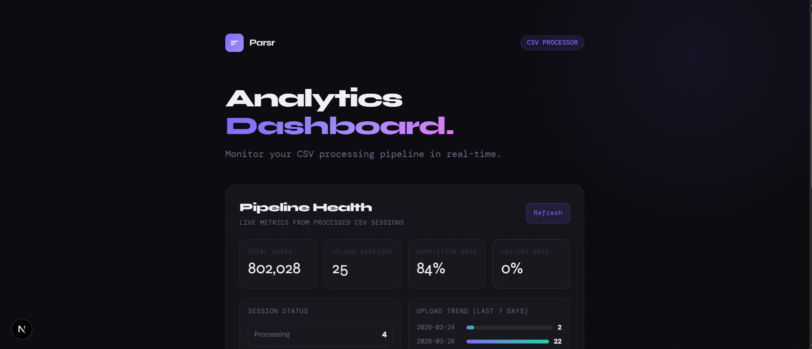
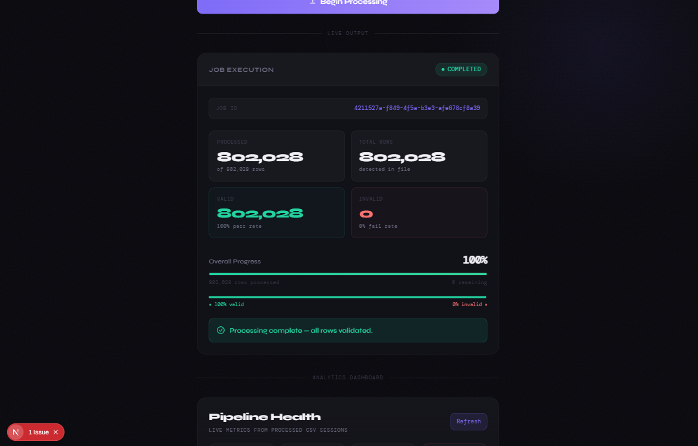

<div style="display: grid; grid-template-columns: repeat(3, 1fr); gap: 10px; margin-bottom: 20px;">
  
  
  
</div>

# Scalable Data Ingestion & Validation Platform

A production-grade backend system designed to process large CSV datasets efficiently using **streaming, background job queues, and real-time monitoring**.


## Problem Statement

Traditional CSV upload systems fail when handling large datasets due to:

* High memory consumption (loading entire files)
* Blocking request-response cycles
* Poor error visibility
* Lack of scalability

This project solves these problems by building a **streaming-based, asynchronous ingestion pipeline**.

---

## System Architecture

```text
Client (React)
   │
   │ Upload CSV
   ▼
API Server (Node.js + Express)
   │
   │ Push Job
   ▼
Redis Queue (BullMQ)
   │
   ▼
Worker Process
   │
   ├── Stream CSV (no full file load)
   ├── Validate rows (multi-layer)
   ├── Batch insert (chunked writes)
   ▼
MongoDB (Persistent Storage)

   ▲
   │
Redis (Progress State)
   │
   ▼
SSE (Server-Sent Events)
   │
   ▼
Frontend Dashboard (Real-time updates)
```

---

## Tech Stack

### Backend

* Node.js
* Express.js
* MongoDB (Mongoose)
* Redis
* BullMQ
* Server-Sent Events (SSE)

### Frontend

* Next.js
* Tailwind CSS

---

## Key Features

### File Upload System

* Secure CSV upload with validation
* File size limits and MIME-type filtering
* Automatic cleanup after processing

---

### Streaming CSV Processing

* Uses `fs.createReadStream` + `csv-parser`
* Handles large files without memory overflow
* Backpressure-aware processing

---

### Multi-Layer Validation Engine

**Layer 1: Structural Validation**

* Required fields
* Header format validation

**Layer 2: Data Validation**

* Email format (regex)
* Age constraints
* Field length checks

**Layer 3: Business Rules**

* Email uniqueness
* Duplicate detection within CSV
* Optional domain restrictions

---

### Optimized Bulk Database Writes

* Chunked operations (500–1000 records per batch)
* Uses MongoDB `bulkWrite`
* Graceful handling of duplicate key errors
* Indexed fields for performance

---

### Invalid Record Tracking

* Stores failed rows with:

  * Error reason
  * Line number
  * Original data
* Enables debugging and auditability

---

### Upload Session Tracking

Each upload session stores:

* File name
* Total / valid / invalid records
* Processing status
* Processing time
* Uploaded by (user)

---

### Real-Time Progress Monitoring

* Implemented using Server-Sent Events (SSE)
* Live updates:

  * Processed rows
  * Success/failure counts
  * Completion status

---

### Analytics Dashboard

* Total users ingested
* Success vs failure ratio
* Upload trends over time
* Age distribution
* Top email domains

Powered by MongoDB aggregation pipelines.

---

### Asynchronous Job Processing

* CSV processing moved to background workers
* Implemented using BullMQ + Redis
* Non-blocking API responses
* Scalable architecture

---

### Security & Production Features

* JWT Authentication
* Role-Based Access Control (RBAC)
* Protected routes
* API rate limiting
* Input sanitization

---

## Performance Benchmarks

| Dataset Size | Processing Time | Memory Usage |
| ------------ | --------------- | ------------ |
| 10,000 rows  | ~1.2s           | <100MB       |
| 100,000 rows | ~8–10s          | ~150MB       |

> Achieved stable memory usage using streaming and chunked processing.

---

## Screenshots

*Add screenshots here:*

* Upload Interface
* Real-time Dashboard
* Invalid Records Table

---

## Challenges & Solutions

### Problem: Memory overflow with large files

Solution: Implemented streaming instead of loading entire file

---

### Problem: Blocking API during processing

Solution: Introduced background job queue with Redis

---

### Problem: Handling duplicate data

Solution: Used indexed fields + bulkWrite error handling

---

### Problem: Real-time progress tracking

Solution: Redis as state store + SSE for live updates

---

## How to Run Locally

```bash
# Clone repo
git clone https://github.com/your-username/your-repo.git

# Install dependencies
cd server && npm install
cd client && npm install

# Setup environment variables
MONGO_URI=
REDIS_URL=
JWT_SECRET=

# Run backend
npm run dev

# Run worker
npm run worker

# Run frontend
npm run dev
```

---

## Future Improvements

* Configurable validation rules (admin-defined)
* Retry mechanism for failed jobs
* WebSocket-based real-time updates
* File storage using AWS S3
* Horizontal scaling with multiple workers

---

## Author

**Beprodeep Das**

---
