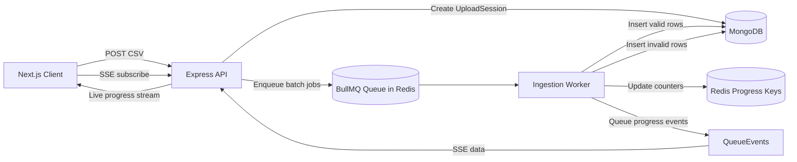

# CSV to JSON Ingestion Platform

This project is a full-stack CSV ingestion system with:

- Next.js frontend dashboard for upload and live progress
- Express API server for upload, SSE progress, and analytics
- BullMQ worker for background batch processing
- MongoDB for persistent domain data
- Redis for queue transport and ephemeral progress counters

## High-Level Architecture



## Repository Structure

- `client/`: Next.js 16 app (React 19)
- `server/`: Express + BullMQ + Mongoose backend
- `server/uploads/`: upload artifacts directory (currently not the primary pipeline path)

## Runtime Components

### 1) Frontend (Next.js)

Primary files:

- `client/app/page.tsx`
- `client/app/layout.tsx`

Responsibilities:

- Accepts a CSV file from user input
- Sends multipart upload request to backend
- Opens an SSE connection to receive live progress
- Renders:
  - processed / total counts
  - valid / invalid counts
  - completion percentage
  - status state (`idle`, `processing`, `completed`, `failed`)

### 2) API Server (Express)

Primary files:

- `server/src/server.ts`
- `server/src/routes/uploadRoute.ts`
- `server/src/routes/progressRoute.ts`
- `server/src/routes/analyticsRoute.ts`

Responsibilities:

- Exposes upload endpoint (`/api/v1/upload`)
- Exposes SSE progress endpoint (`/api/v1/progress/:jobId`)
- Exposes analytics endpoint (`/api/v1/analytics/overview`)
- Boots only after MongoDB connection succeeds
- Uses CORS for `http://localhost:3000`

### 3) Queue Layer (BullMQ)

Primary files:

- `server/src/queues/ingestionQueue..ts`
- `server/src/queues/queueEvents.ts`

Responsibilities:

- Queue name: `csv-ingestion`
- Receives batch jobs produced by CSV streaming parser
- Emits progress/completion/failure events consumed by SSE routes

### 4) Worker (Background Processor)

Primary file:

- `server/src/workers/ingestionWorker.ts`

Responsibilities:

- Consumes queue jobs with concurrency 5
- Validates each row via `validateRow`
- Persists valid rows to `User`
- Persists invalid rows to `InvalidRow`
- Updates Redis counters for processed/valid/invalid
- Marks `UploadSession` as completed when all batches finish

### 5) Data Stores

MongoDB models:

- `UploadSession` (`server/src/models/UploadSession.ts`)
- `User` (`server/src/models/User.ts`)
- `InvalidRow` (`server/src/models/InvalidRow.ts`)
- `Admin` (`server/src/models/adminModel.ts`)

Redis usage:

- BullMQ transport
- Progress hash (source of truth for UI/SSE):
  - key: `progress:{jobId}`
  - fields: `total`, `processed`, `valid`, `invalid`, `status`
- Batch tracking keys:
  - `job:{jobId}:totalBatches`
  - `job:{jobId}:completedBatches`
- Idempotency key per batch:
  - `job:{jobId}:batch:{batchJobId}`

## End-to-End Data Flow

### Upload + Processing Flow

1. User selects a CSV file in frontend (`client/app/page.tsx`).
2. Frontend sends multipart POST to `http://localhost:5000/api/v1/upload`.
3. Backend route (`uploadRoute`) creates a base `jobId` and parses stream with Busboy.
4. On file event, backend creates `UploadSession` document with `processing` status.
5. `processCSVStream` pipes file through `csv-parser` and chunks rows in batches of 500.
6. Each batch is enqueued to BullMQ as `processBatch` with job id format: `{jobId}-{batchNumber}`.
7. Worker consumes batches:
   - validates rows (`name` and `email` required)
   - inserts valid rows into `User`
   - inserts invalid rows into `InvalidRow`
8. Worker updates Redis hash counters using atomic increments (`HINCRBY`) and also updates BullMQ progress.
9. Progress route reads Redis hash snapshots and streams them over SSE (polling + queue event triggers).
10. Frontend receives SSE messages and updates UI state/progress bar.
11. When all batches are completed, worker marks Redis status as `completed` and updates `UploadSession`.

### Progress Streaming Flow

Route path used by current frontend:

- `GET /api/v1/progress/:jobId`

Behavior:

- Opens SSE connection
- Reads progress from Redis hash snapshots to avoid missed/misaligned queue-only updates
- Uses queue events as a trigger to refresh snapshots quickly
- Sends completion or failure state based on Redis `status` and then closes stream
- Emits heartbeat every 15s to keep connection alive

## API Surface (Current)

Mounted routes from `server/src/server.ts`:

- `POST /api/v1/upload`
- `GET /api/v1/progress/:jobId`
- `GET /api/v1/analytics/overview`
- `GET /upload/stream/:jobId` (alternate SSE route)

Defined but currently not mounted in `server.ts`:

- `GET /sessions` (from `sessionsRoute.ts`, role-protected)
- `GET /invalid-rows` (from `invalidRowRoute.ts`, role-protected)

Authentication components present:

- `login` controller in `auth.controller.ts`
- JWT middleware in `auth.middleware.ts`

These auth pieces are implemented but not currently wired to mounted auth routes.

## Analytics Endpoint

`GET /api/v1/analytics/overview` aggregates:

- total users count
- upload session status distribution (`processing`, `completed`, `failed`)
- daily upload trends
- age bucket distribution
- top 5 email domains

## Validation Rules (Current)

`server/src/utils/validator.ts` currently validates only:

- `name` is present
- `email` is present

No strict email format or age constraints are enforced in this function at the moment.

## How to Run Locally

### Prerequisites

- Node.js 20+
- MongoDB running on `mongodb://127.0.0.1/csv_ingestion`
- Redis running on `127.0.0.1:6379`

### Install Dependencies

From workspace root:

```bash
cd server && npm install
cd ../client && npm install
```

### Start Services

Open separate terminals:

1. API server

```bash
cd server
npm run dev
```

2. Worker

```bash
cd server
npm run worker
```

3. Frontend

```bash
cd client
npm run dev
```

Then open `http://localhost:3000`.

## Important Implementation Notes

- Queue file name currently contains a double dot: `ingestionQueue..ts`.
- Imports reference `../queues/ingestionQueue.` which relies on that filename.
- `server/tsconfig.json` uses `module: CommonJS` while `server/package.json` sets `type: module`.
- `sessionsRoute.ts` and `invalidRowRoute.ts` do not export the router in the current code.
- `auth.controller.ts` and role middleware exist, but auth routes are not mounted in `server.ts`.

## Progress Reliability Notes

- Progress counters are concurrency-safe because worker updates use Redis atomic increments.
- Final UI percentage is derived from Redis snapshot status and counters (not only queue event payload).
- If UI behavior does not reflect latest code changes, restart both API and worker processes.

## Suggested Next Improvements

1. Normalize queue filename/imports to avoid portability issues.
2. Align TypeScript module config with runtime module type.
3. Mount auth, sessions, and invalid-row routes deliberately (or remove dead code).
4. Add stronger CSV validation (email format, age range, required schema headers).
5. Add TTL/cleanup for Redis progress keys.
6. Add tests for upload, worker idempotency, and SSE lifecycle.
